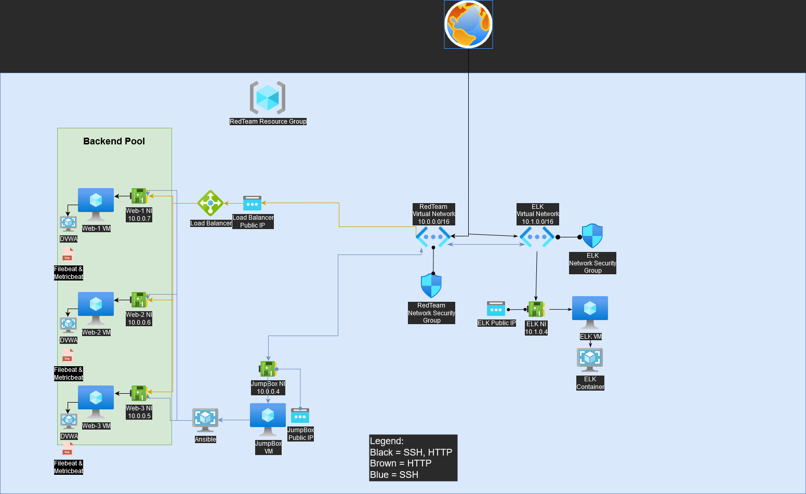
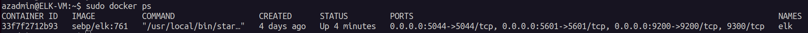

## Automated ELK Stack Deployment

The files in this repository were used to configure the network depicted below.



These files have been tested and used to generate a live ELK deployment on Azure. They can be used to either recreate the entire deployment pictured above. Alternatively, select portions of the [YAML Directory](yml_files) may be used to install only certain pieces of it, such as Filebeat.

  - [YAML Directory](yml_files)

This document contains the following details:
- Description of the Topology
- Access Policies
- ELK Configuration
  - Beats in Use
  - Machines Being Monitored
- How to Use the Ansible Build

### Description of the Topology

The main purpose of this network is to expose a load-balanced and monitored instance of DVWA, the D*mn Vulnerable Web Application.

Load balancing ensures that the application will be highly responsive, in addition to restricting connection to the network.
- _Load balancers have the ability to protect servers behind it's backend pool from being overloaded with data by distributing to its respective redundant servers._
- _The advantage of a jump box is that it restricts access and acts as a gateway for ssh connections in this environment setup._

Integrating an ELK server allows users to easily monitor the vulnerable VMs for changes to the CPU usage and system logs.
- _Filebeat monitors and collects log events of the servers it is installed in such as ssh connection logs_
- _Metricbeat collects metrics from the Operating system (O.S.) and from services running under the server such as CPU load_

The configuration details of each machine may be found below.

|         Name         |        Function        | IP Address | Operating System |
|:--------------------:|:----------------------:|:----------:|:----------------:|
| Jump-Box-Provisioner | Gateway                | 10.0.0.4   | Linux            |
|         Web-1        | Redundant Web Server 1 | 10.0.0.7   | Linux            |
|         Web-2        | Redundant Web Server 2 | 10.0.0.6   | Linux            |
|         Web-3        | Redundant Web Server 3 | 10.0.0.5   | Linux            |
|        ELK-VM        | ELK Server             | 10.1.0.4   | Linux            |

### Access Policies

The machines on the internal network are not exposed to the public Internet. 

Only the Load Balancer can accept connections from the Internet. Access to the web servers are only allowed from the following IP addresses via HTTP (Port 80, TCP):
- _[Load Balancer's Public IP (40.122.45.183)](http://40.122.45.183)_

Machines within the network can only be accessed by Jump-Box-Provisioner's Ansible Container via SSH.
- _I used the Jump-Box-Provisioner's Ansible container with it's IP 10.0.0.4._

A summary of the access policies in place can be found in the table below.

|   Name   | Publicly Available |     Allowed IP Address    |
|:--------:|:------------------:|:-------------------------:|
| Jump-Box |         No         | Local Machine's Public IP |
|   Web-1  |         Yes        |          Internet         |
|   Web-2  |         Yes        |          Internet         |
|   Web-3  |         Yes        |          Internet         |
|  ELK-VM  |         No         |          10.0.0.4         |

### Elk Configuration

Ansible was used to automate configuration of the ELK machine. No configuration was performed manually, which is advantageous because...
- _The main advantage of automating configurations with Ansible is efficient synchronicity in deploying programs across all separate systems._

The playbook implements the following tasks:
- _Checks and installs docker.io_
- _Checks and installs python3-pip_
- _Checks and installs docker module (python)_
- _Increasing virtual memory_
- _Check, download, and run elk container with published ports_
- _Enable docker service on boot_

The following screenshot displays the result of running `docker ps` after successfully configuring the ELK instance.



### Target Machines & Beats
This ELK server is configured to monitor the following machines:
- _10.0.0.7, 10.0.0.6, 10.0.0.5_

We have installed the following Beats on these machines:
- _Filebeat_
- _Metricbeat_

These Beats allow us to collect the following information from each machine:
- _Filebeat collects log files and system logs_
- _Metricbeat collects metric for CPU, Network, and other services_

### Using the Playbook
In order to use the playbook, you will need to have an Ansible control node already configured. Assuming you have such a control node provisioned: 

- _`configELK.yml` is the ansible-playbook copied from [install-elk.yml](https://columbia.bootcampcontent.com/columbia-bootcamp/CU-VIRT-CYBER-PT-02-2022-U-LOL/-/raw/main/13-ELK-Stack-Project/Activities/Stu_Day_1/Unsolved/Resources/install-elk.yml)_
```
curl https://columbia.bootcampcontent.com/columbia-bootcamp/CU-VIRT-CYBER-PT-02-2022-U-LOL/-/raw/main/13-ELK-Stack-Project/Activities/Stu_Day_1/Unsolved/Resources/install-elk.yml > configELK.yml
```

- _Updated the `hosts` file to include the ELK-VM under the category `elk`_
```
nano /etc/ansible/hosts
# add [elk] and 10.1.0.4
```

- Run the playbook, and navigate to 20.242.81.178:5601 to check that the installation worked as expected.
```
#On CLI local host (if unix-based)
open 20.242.81.178:5601
```